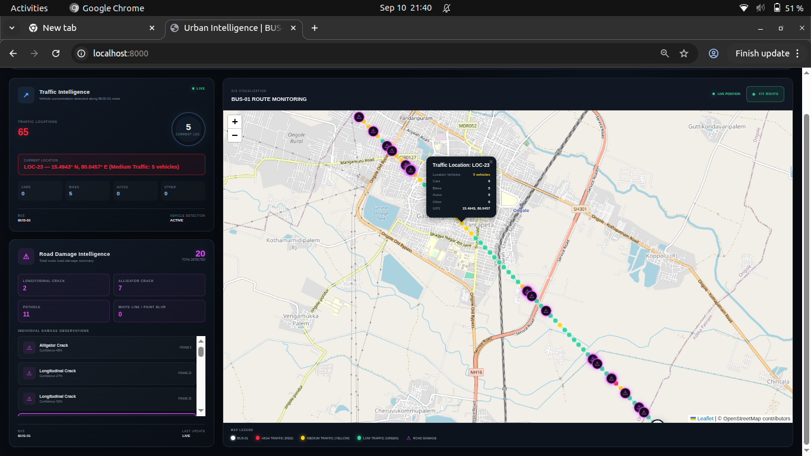

# Urban Intelligence: Road Damage & Vehicle Detection System

Urban Intelligence is an AI-powered road monitoring and traffic intelligence system. It uses YOLO deep learning models to detect road damage (like potholes and cracks) and vehicles (cars, bikes, autos, trucks) from video feeds, saving detections with GPS coordinates and displaying them on an interactive GIS map dashboard.

---

## 📸 Screenshots & Visual Demonstrations

### 1. AI Detection Model Output
The trained YOLO model automatically identifies road abnormalities and vehicle types in real time:


### 2. Live Interactive Dashboard
The web dashboard visualizes route data, traffic locations with color-coded dots, and road damage statistics:



---

## ✨ Key Features

- **Road Damage Intelligence**:
  - Automatically identifies 4 key road damage categories:
    - **Longitudinal Crack** (`D00`)
    - **Alligator Crack** (`D20`)
    - **Pothole** (`D40`)
    - **White Line / Paint Blur** (`D44`)
  - Tracks total road damage detected along the entire bus route.

- **Traffic Intelligence**:
  - Detects vehicles: Cars, Bikes/Motorcycles, Autos/Autorickshaws, Buses, and Trucks.
  - Groups vehicles into location-based traffic zones.
  - Displays **Current Location Vehicle Count** and vehicle type breakdown.

- **GIS Map Visualization**:
  - Color-coded map dots for easy traffic monitoring:
    - 🔴 **Red Dots**: High Traffic (8+ vehicles)
    - 🟡 **Yellow Dots**: Medium Traffic (5–7 vehicles)
    - 🟢 **Green Dots**: Low Traffic (1–4 vehicles)
  - Interactive map markers showing road damage details (confidence %, GPS coordinates, frame number).

---

## 🛠️ Technology Stack

- **Backend**: Python, FastAPI, Uvicorn, PostgreSQL (Psycopg2)
- **AI / Computer Vision**: YOLO (Ultralytics), OpenCV
- **Frontend**: HTML5, Vanilla CSS, JavaScript (ES6+), Leaflet.js

---

## 🚀 How to Run the Web Application

1. Make sure PostgreSQL database service is running locally.
2. Start the FastAPI web application server:

```bash
uvicorn api:app --reload --port 8000
```

3. Open your web browser and navigate to:
```
http://localhost:8000
```
